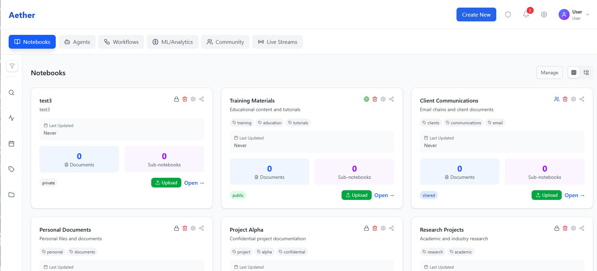

# Aether AI Portal

**Aether** is a comprehensive enterprise multimodal AI platform designed for sophisticated AI capabilities including document processing, AI agents, workflow automation, ML analytics, and real-time data streaming.



## 🚀 Features

### Core Capabilities
- **📚 Document Notebooks**: Multimodal document processing with real-time collaboration
- **🤖 AI Agents**: Media-aware agents supporting documents, images, audio, video, signatures, and handwriting
- **⚡ Automation Workflows**: Event-driven processing pipelines with visual workflow builder
- **📊 ML/Analytics Dashboard**: Model management, experiments, and performance monitoring
- **🌍 Community Marketplace**: Shared templates, components, and collaborative features
- **📈 Live Data Streams**: Real-time event processing with comprehensive audit trails

### Enterprise Features
- **🔒 HIPAA Compliance**: Enterprise-grade security and compliance features
- **🛡️ PII Detection**: Automated personally identifiable information detection and protection
- **📋 Audit Scoring**: Comprehensive audit trails and compliance scoring
- **👥 Multi-tenant Support**: Organizations and teams management
- **🔐 Authentication**: Secure authentication and authorization system

## 🏗️ Architecture

Aether is built with modern web technologies and follows enterprise-grade architectural patterns:

### Frontend Stack
- **React 19** with TypeScript for type-safe development
- **Tailwind CSS 4** for responsive, utility-first styling
- **Lucide React** for consistent iconography
- **React Router** for client-side routing
- **Redux Toolkit** for state management
- **Recharts** for data visualization
- **ReactFlow** for workflow visualization

### Key Components
- **Notebook System**: Multi-modal document processing and collaboration
- **Agent Framework**: Extensible AI agent system with media processing capabilities
- **Workflow Engine**: Visual workflow builder with drag-and-drop interface
- **Analytics Engine**: Real-time metrics and performance monitoring
- **Community Platform**: Template sharing and collaborative features

## 📁 Project Structure

```
aether/
├── src/
│   ├── components/           # Reusable UI components
│   │   ├── notebooks/       # Notebook-related components
│   │   ├── workflow/        # Workflow builder components
│   │   ├── charts/          # Data visualization components
│   │   ├── modals/          # Modal dialogs
│   │   └── ui/              # Core UI components
│   ├── pages/               # Main application pages
│   ├── hooks/               # Custom React hooks
│   ├── services/            # API services and external integrations
│   ├── store/               # Redux store configuration
│   ├── contexts/            # React contexts
│   └── utils/               # Utility functions
├── docs/                    # CSS modules and documentation
├── k8s/                     # Kubernetes deployment configurations
├── public/                  # Static assets
└── dist/                    # Production build output
```

## 🛠️ Development Setup

### Prerequisites
- Node.js 18+
- npm or yarn package manager

### Installation

1. **Clone the repository**
   ```bash
   git clone https://github.com/Tributary-ai-services/aether.git
   cd aether
   ```

2. **Install dependencies**
   ```bash
   npm install
   ```

3. **Start development server**
   ```bash
   npm run dev
   ```

4. **Open your browser**
   Navigate to `http://localhost:5173` to view the application

### Available Scripts

- `npm run dev` - Start development server with hot reload
- `npm run build` - Build for production (TypeScript compilation + Vite build)
- `npm run lint` - Run ESLint for code quality checks
- `npm run preview` - Preview production build locally

## 🚢 Deployment

### Docker Deployment

The project includes Docker configuration for containerized deployment:

```bash
# Development
docker build -f Dockerfile.dev -t aether:dev .

# Production
docker build -t aether:prod .
docker run -p 80:80 aether:prod
```

### Docker Compose

For local development with full stack:

```bash
docker-compose up -d
```

### Kubernetes Deployment

Kubernetes manifests are available in the `k8s/` directory:

```bash
kubectl apply -k k8s/
```

## 🔧 Configuration

### Environment Variables

The application supports various environment configurations. Key areas include:

- Authentication configuration
- API endpoints
- Feature flags
- Compliance settings

### Theme Customization

Aether supports extensive theme customization through:
- CSS custom properties
- Tailwind configuration
- Component-level theming

## 🧪 Testing

The project includes comprehensive testing setup:
- Unit tests for components and utilities
- Integration tests for workflows
- E2E testing capabilities

## 📖 Documentation

Additional documentation is available:

- [Authentication Flow](AUTHENTICATION_FLOW.md)
- [Backend Design](BACKEND-DESIGN.md)
- [Notebook Persistence](NOTEBOOK_PERSISTENCE.md)
- [Upload Functionality Guide](UPLOAD_FUNCTIONALITY_GUIDE.md)
- [Drag & Drop Upload Guide](DRAG_DROP_UPLOAD_GUIDE.md)

## 🤝 Contributing

1. Fork the repository
2. Create a feature branch (`git checkout -b feature/amazing-feature`)
3. Commit your changes (`git commit -m 'Add some amazing feature'`)
4. Push to the branch (`git push origin feature/amazing-feature`)
5. Open a Pull Request

## 📄 License

This project is licensed under the Apache License 2.0 - see the [LICENSE](LICENSE) file for details.

## 🏢 Enterprise Support

Aether is designed for enterprise deployment with:
- Multi-tenant architecture
- HIPAA compliance capabilities
- Advanced audit and compliance features
- Professional support options

For enterprise inquiries and support, please contact the development team.

---

**Built with ❤️ for the future of AI-powered document processing and workflow automation.**