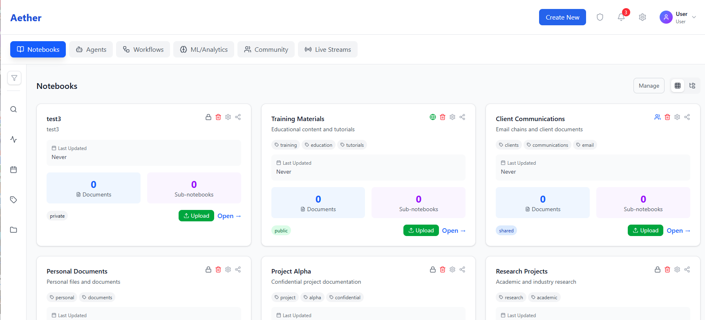
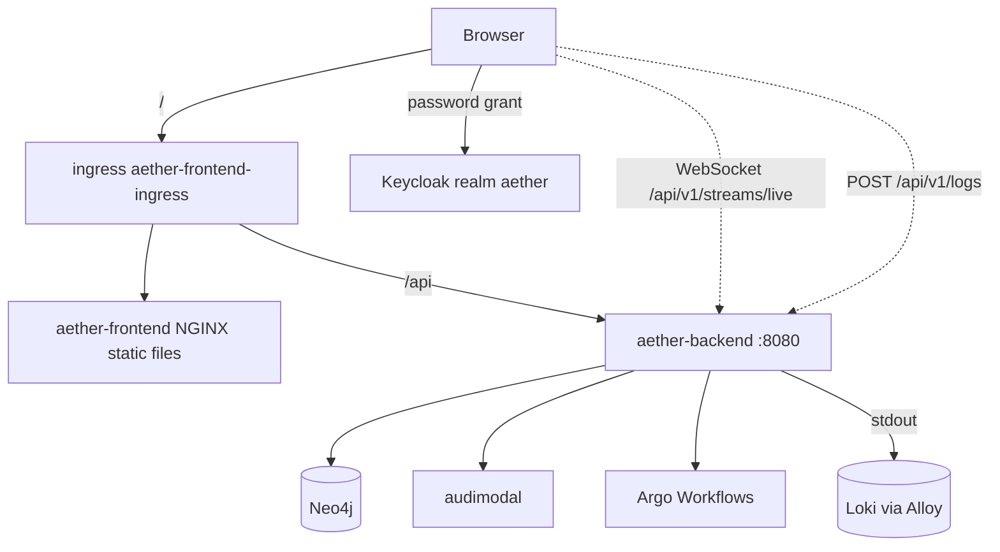

# Aether — the TAS platform front end



## 🧭 What this is

Aether is the browser application people sign into to use the Tributary AI Services (TAS) platform: notebooks of multimodal documents, agents configured through a form, workflows drawn on a canvas, spaces shared with a team, and a live event feed. It is a React 19 single-page application (SPA), built by Vite and served as static files by NGINX.

It is not the platform. No server, no database, no model inference lives here. Document processing belongs to `audimodal`, model routing to `tas-llm-router`, and graph plus relational storage sits behind `aether-be`. Every screen that shows real data is a view over the `aether-be` API. Start this repository on its own and you get a login form and, after signing in, empty screens — which is the single most common first-run surprise and is covered under Quick start below.

## 📌 Status & scope

**Verified 2026-08-26.** This runs in production. The deployment is `aether-frontend` in namespace `aether-be` on the TAS K3s cluster, image `registry-api.tas.scharber.com/aether-frontend:dup-agent-fix-20260619`, reachable at `https://aether.tas.scharber.com` through the ingress `aether-frontend-ingress`. That ingress routes `/` to this application and `/api` on the same host to `aether-backend:8080`, which is why the code can default its API base to the page origin. The running image was built from the commit this document is verified against, and the stylesheet hash served in production matches a local `npm run build` of that commit. It is a single replica with `imagePullPolicy: Always`, so shipping a change means building the image with the production build arguments, pushing it to `registry-api.tas.scharber.com`, and replacing the pod — a local image is never picked up. The full procedure is in [./CLAUDE.md](./CLAUDE.md).

The useful split is not by feature name but by what is wired to the backend. Three groups exist, and the older feature list did not distinguish them.

| Area | State today | Evidence |
|---|---|---|
| Notebooks, documents, spaces, sharing, comments, invitations, chat conversations | Backend-backed | `src/services/aetherApi.js:24` request path; slices in `src/store/slices/` |
| Workflows (canvas, templates, publish, execute) | Backend-backed, forwarded to Argo by `aether-be` | `src/services/api.js:748` delegates to `aetherApi.workflows` |
| Compliance violations panel and badge | Backend-backed | `src/store/slices/complianceSlice.js:55`; `GET /api/v1/compliance/summary` answers 401 without a token |
| Live Streams | Backend-backed over a WebSocket | `src/services/streamingSocket.js:6` connects `/api/v1/streams/live` |
| Agent Builder, onboarding, notebook producers | Backend-backed through `src/services/api.js` | 38 lines in that file call through to `aetherApi` |
| ML/Analytics page, its three charts, and model or experiment lists | Static demo data, no network call at all | `src/pages/AnalyticsPage.jsx:2` imports from `src/data/mockData.js` |
| Community marketplace | Public workflows are real; skills and catalogue entries fall back to fixtures | `src/pages/CommunityPage.jsx:43` |
| Audit Trail modal | Static demo data | `src/context/AuditContext.jsx:16` |

Two claims in the previous version of this page did not survive checking. There are **no tests** — no test files, no test runner in `package.json`, no `test` script, and no `.github/` workflow directory, so the earlier description of unit, integration and end-to-end testing described nothing that exists. And the platform is far less typed than "React 19 with TypeScript" implies: 10 of the 269 files under `src/` are `.ts`/`.tsx`, the remaining 259 are `.js`/`.jsx`, and `tsconfig.json:18` sets `"strict": false`, so `npm run build` type-checks a small minority of the code.

Compliance wording deserves the same correction. The old list advertised Health Insurance Portability and Accountability Act (HIPAA) compliance, personally identifiable information (PII) detection, and audit scoring as capabilities of this application. Detection happens in backend services; what this repository contributes is the compliance settings on a notebook, the violations list and acknowledgement flow fed by `/api/v1/compliance/*`, and an audit modal that currently renders a fixed array.

Also still true and worth knowing before you plan work: `src/services/api.js:1` describes itself as a mock API service and is imported by 13 modules; `src/services/audiModalAdapter.js` and `src/services/audiModalService.js` have no importers at all; and the `k8s/` directory here is not what runs — its ingress host is a placeholder domain and its container reads a `REACT_APP_API_URL` variable that no code consumes.

## 🚀 Quick start

You need Node and npm, and network access to an `aether-be` backend plus its Keycloak. There is no offline mode and no bundled backend. Everything below was run on this commit; the outputs are captures, not illustrations.

### 1. Install packages

Node 20 or newer is what the Dockerfile uses and what several dependencies ask for. Node 18 installs and builds anyway, with warnings:

```console
$ npm install
npm WARN EBADENGINE Unsupported engine {
npm WARN EBADENGINE   package: 'react-router-dom@7.7.1',
npm WARN EBADENGINE   required: { node: '>=20.0.0' },
npm WARN EBADENGINE   current: { node: 'v18.19.1', npm: '9.2.0' }
npm WARN EBADENGINE }

added 513 packages, and audited 514 packages in 56s

14 vulnerabilities (1 low, 1 moderate, 11 high, 1 critical)
```

That took a little under a minute on a warm npm cache (`real 0m59.703s`). The engine warnings are not fatal here, but treat Node 20 as the supported floor since that is what the release image builds with.

### 2. Give it a backend to talk to

Vite bakes `VITE_*` values into the bundle, so they are read at build time and at dev-server start, never at runtime. Create `.env.local` (already ignored by `.gitignore:69`) pointing at a backend you can reach:

```ini
VITE_AETHER_API_BASE=https://aether.tas.scharber.com
VITE_AETHER_API_URL=https://aether.tas.scharber.com/api/v1
VITE_KEYCLOAK_URL=https://keycloak.tas.scharber.com
VITE_KEYCLOAK_REALM=aether
VITE_KEYCLOAK_CLIENT_ID=aether-frontend
```

Skipping this step is the mistake that costs the most time, because it fails quietly rather than loudly — see below.

### 3. Start the dev server

```console
$ npm run dev

> aether@1.0.0 dev
> vite

  VITE v6.3.5  ready in 256 ms

  ➜  Local:   http://localhost:3000/
  ➜  Network: use --host to expose
```

Port 3000, set in `vite.config.ts:8` — not Vite's default 5173, and not the 3001 that the Docker Compose container publishes.

### 4. Sign in

The login form posts a password grant straight to Keycloak from the browser (`src/contexts/AuthContext.jsx:115`), not through the backend. Realm `aether`, public client `aether-frontend` — both defaulted in `src/services/aetherApi.js:11`. Use a real user in that realm; the shared TAS credentials live in the `aether-secrets` repository and in the Keycloak admin console, and none of them belong in this repository. On success the identity token is kept in session storage and attached to every API call as a bearer token. Until you are authenticated, `src/App.tsx:285` renders the login page for every route.

### What goes wrong first

**No API base set.** The dev server has no proxy configured, so calls to `/api/v1/...` are answered by Vite's SPA fallback with the index page and a 200:

```console
$ curl -s -o /dev/null -w "%{http_code}\n" http://localhost:3000/api/v1/notebooks
200
$ curl -s http://localhost:3000/api/v1/notebooks | head -c 15
<!doctype html>
```

The application receives page markup where it expected JSON, so screens render empty with parse errors in the console instead of an obvious network failure. Setting `VITE_AETHER_API_URL` to an absolute backend URL is the fix; restart the dev server afterwards, since the value is inlined at start.

**Bad or unreachable Keycloak.** A rejected password surfaces as `Invalid email or password` (`src/contexts/AuthContext.jsx:134`); anything else from the token endpoint surfaces as `Authentication service error` (`src/contexts/AuthContext.jsx:136`). Both messages come from the browser, so the browser network tab shows the real status.

**Calling the deployed API by hand.** The ingress certificate is issued by the internal TAS certificate authority, so curl needs `-k`, or that issuer added to your trust store:

```console
$ curl -s https://aether.tas.scharber.com/api/v1/notebooks
curl: (60) SSL certificate problem: unable to get local issuer certificate
$ curl -sk https://aether.tas.scharber.com/api/v1/notebooks
{"code":"UNAUTHORIZED","message":"Authorization token is required"}
```

That 401 is the healthy answer — it proves the route is mounted and the token is what is missing.

### Build and lint

Both pass on this commit. The build type-checks with `tsc`, then bundles:

```console
$ npm run build

> aether@1.0.0 build
> tsc && vite build

vite v6.3.5 building for production...
✓ 2880 modules transformed.
dist/index.html                           0.47 kB │ gzip:   0.30 kB
dist/assets/index-B3IiWifO.css          101.47 kB │ gzip:  16.01 kB
dist/assets/agentBuilder-C8iqNAWl.js      1.16 kB │ gzip:   0.40 kB
dist/assets/index-CmTDafbF.js         2,627.92 kB │ gzip: 647.26 kB

(!) Some chunks are larger than 500 kB after minification.
✓ built in 45.52s
```

The main chunk is not code-split; that warning is expected output, not a regression. The linter is clean against its configured budget of 50 warnings (`package.json:13`):

```console
$ npm run lint
✖ 40 problems (0 errors, 40 warnings)
```

All 40 are `@typescript-eslint/no-unused-vars` on unused icon imports and `@typescript-eslint/no-explicit-any` in the typed files. Adding ten more warnings will break the build for everyone, so clear some while you are in a file.

## 🔗 How it fits


```mermaid
graph TD
    B[Browser] -->|"/"| ING[ingress aether-frontend-ingress]
    B -->|password grant| KC[Keycloak realm aether]
    ING --> FE[aether-frontend NGINX static files]
    ING -->|"/api"| BE[aether-backend :8080]
    B -.->|"WebSocket /api/v1/streams/live"| BE
    B -.->|"POST /api/v1/logs"| BE
    BE --> NEO[(Neo4j)]
    BE --> AUD[audimodal]
    BE --> ARGO[Argo Workflows]
    BE -->|stdout| LOKI[(Loki via Alloy)]
```

Two hard dependencies, and they fail differently. Without **Keycloak** you cannot get past the login form at all, because the token request goes browser-to-Keycloak directly. Without **aether-be** you can still sign in — and then every data screen stays empty, because the backend owns notebooks, spaces, workflows, compliance, comments and the stream feed. Nothing here degrades to cached content.

State is Redux, and that is a project rule rather than a preference. The store is configured in `src/store/store.js:22` with 18 slices, mounted once at `src/main.tsx:36`. New shared state belongs in a slice under `src/store/slices/`, exported through `src/store/index.js`, rather than in a new provider: the six providers under `src/context/` are all still wired up (five in `src/main.tsx`, `FilterProvider` at `src/App.tsx:309`), but the direction of travel is out of them — space selection was moved from `SpaceContext` into `spacesSlice` in commit `b071966`.

The browser also ships its own logs back through the platform. `src/services/logging.ts` batches entries, flushes every five seconds or at 20 entries, flushes errors immediately, and posts them to `/logs` on the backend (`src/services/logging.ts:118`), which writes them to stdout for Alloy to collect into Loki. Because the batch goes through the authenticated client, logs only reach Loki for a signed-in session; a 30-day Loki query on 2026-08-26 found no successful frontend batches, consistent with no browser sessions rather than a broken path. Query them with `{namespace="aether-be", source="frontend"}` in Grafana Explore.

## 🔧 Configuration

Everything is a build-time `VITE_*` variable. Changing one in the cluster means rebuilding and pushing the image, not editing a ConfigMap — the values are compiled into the JavaScript bundle.

| Variable | What it changes | Code default | Production build |
|---|---|---|---|
| `VITE_AETHER_API_URL` | Base for every backend call | `window.location.origin` + `/api/v1` (`src/services/aetherApi.js:5`) | `/api/v1`, so it follows the ingress |
| `VITE_AETHER_API_BASE` | Base for the health probe | page origin | empty, same reason |
| `VITE_KEYCLOAK_URL` | Token endpoint host | `https://keycloak.tas.scharber.com` | empty, so the page origin is used |
| `VITE_KEYCLOAK_REALM` | Realm for the password grant | `aether` (`src/services/aetherApi.js:11`) | `aether` |
| `VITE_KEYCLOAK_CLIENT_ID` | Public client id | `aether-frontend` | `aether-frontend` |
| `VITE_DEV_MODE` | Loads browser console auth helpers at `src/main.tsx:24` | unset | unset |
| `VITE_LLM_ROUTER_URL` | Base for the bypass-token screen in Settings | page origin | unset |
| `VITE_AUDIMODAL_API_URL` | Base for the unused AudiModal adapter | `http://localhost:8084/api/v1` | unset |

The code defaults differ from the production build in a way that matters: locally the defaults point at the deployed cluster, while the deployed bundle is built with empty or relative values so it rides the ingress. Build a production image with the defaults left in place and it will call `localhost` from the user's browser.

**Secrets by location.** Nothing sensitive should be committed here. Keycloak users and passwords are held in Keycloak (realm `aether`) and mirrored for automation in the `aether-secrets` repository; TLS material is a cert-manager `Secret` named `aether-frontend-tls` in namespace `aether-be`. One exception needs cleaning up rather than copying: `docker-compose.yml:18` carries a plaintext development password as a build argument, which lands in the image layers of anything built from that file.

## 📚 Where to go next

- [Development authentication setup](DEV_AUTH_SETUP.md) — the token flow, rotation, and browser console helpers in detail. Note that it still names the `master` realm; the code moved to `aether` and this page reflects the code.
- [Backend design](BACKEND-DESIGN.md) — the API contract this application codes against.
- [Notebook persistence](NOTEBOOK_PERSISTENCE.md) — how notebook state survives a reload.
- [User guide](docs/USER_GUIDE.md) — the product-level tour, useful for naming things the way users do.
- Component tours for the larger areas: [notebooks](docs/NOTEBOOKS_COMPONENTS_GUIDE.md), [workflows](docs/WORKFLOWS_COMPONENTS_GUIDE.md), [agents](docs/AGENTS_COMPONENTS_GUIDE.md), [live streams](docs/LIVE_STREAMS_COMPONENTS_GUIDE.md), [community](docs/COMMUNITY_COMPONENTS_GUIDE.md), [ML analytics](docs/ML_ANALYTICS_COMPONENTS_GUIDE.md).
- [Upload behaviour](docs/UPLOAD_FUNCTIONALITY_GUIDE.md) and [drag-and-drop uploads](docs/DRAG_DROP_UPLOAD_GUIDE.md) — the file paths into `audimodal`.
- [./CLAUDE.md](./CLAUDE.md) — the deploy procedure, including the registry push step that is easy to forget, plus the logging conventions.
- Logs and dashboards: Grafana Explore against Loki, `{namespace="aether-be", container="aether-frontend"}` for the NGINX access log and `{namespace="aether-be", source="frontend"}` for browser events.

## 🤝 Contributing

Branch, commit, open a pull request against `main`. Before pushing, run `npm run build` and `npm run lint` — there is no CI to catch you, and the lint budget is close to its ceiling.

## 📄 License

Apache License 2.0 — see [LICENSE](LICENSE). The `license` field in `package.json` disagrees with that file and should be corrected to match.

---

**Built with ❤️ for the future of AI-powered document processing and workflow automation.**
